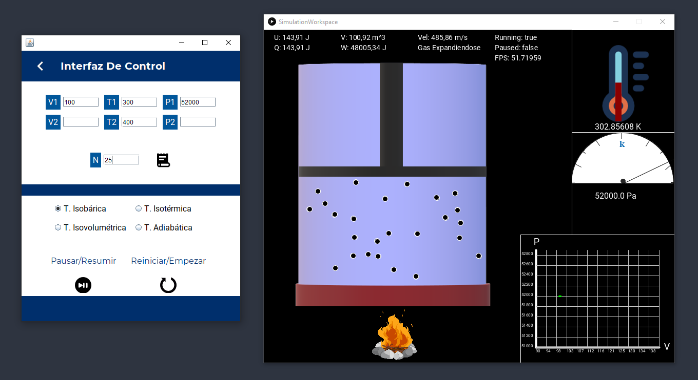

# Simulador de Gases Ideales
> Simular por computador transformaciones de los gases ideales

Creado en Java y Processing, permite simular diferentes transformaciones como la isobárica o adiabática a través de simples animaciones. Además, permite el guardado de los datos generados en formato csv.

## Instalación

Descarga el .zip ubicado en releases, descomprímelo y ejecuta el .jar  
_Debes tener instalado java 8 o superior para poder usar el programa._

## Release History

* 1.0.1
    * Primera versión estable

## Dependencias

Si deseas probar el código fuente, el programa usa las siguientes dependencias, la mayoría las puedes encontrar junto con el ejecutable.

* JUnit 4.13
* inevaup-dialogs-v1.2.jar
* core de processing
* json-simple-3.1.1

